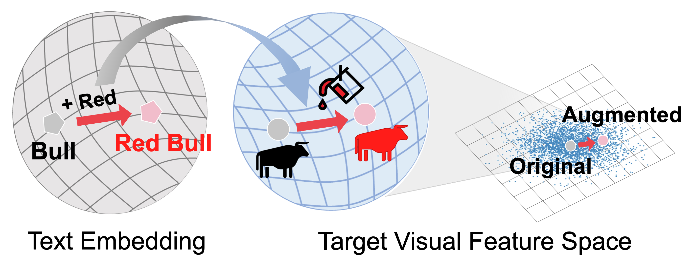

# TextManiA: Enriching Visual Feature by Text-driven Manifold Augmentation (ICCV 2023)
Authors: [Moon Ye-Bin](https://sites.google.com/g.postech.edu/moon-ye-bin), [Jisoo Kim](https://memesoo99.github.io/), Hongyeob Kim, [Kilho Son](https://scholar.google.com/citations?user=QkE4eVcAAAAJ&hl=en) [Tae-Hyun Oh](https://ami.postech.ac.kr/members/tae-hyun-oh)

### [Paper](https://openaccess.thecvf.com/content/ICCV2023/papers/Ye-Bin_TextManiA_Enriching_Visual_Feature_by_Text-driven_Manifold_Augmentation_ICCV_2023_paper.pdf) | [Project Page](https://textmania.github.io/)

This repository is official implementation for the ICCV 2023 paper, [TextManiA](https://openaccess.thecvf.com/content/ICCV2023/papers/Ye-Bin_TextManiA_Enriching_Visual_Feature_by_Text-driven_Manifold_Augmentation_ICCV_2023_paper.pdf). 
TextManiA augments the target visual feature by leveraging text embedding of the visually mimetic words (i.e., attributes), which are comprehensible and semantically rich. 
<p align="center">
  
</p>
<br>

> **Abstract:** *Recent label mix-based augmentation methods have shown their effectiveness in generalization despite their simplicity, and their favorable effects are often attributed to semantic-level augmentation. However, we found that they are vulnerable to highly skewed class distribution, because scarce data classes are rarely sampled for inter-class perturbation.
We propose TextManiA, a text-driven manifold augmentation method that semantically enriches visual feature spaces, regardless of data distribution. TextManiA augments visual data with intra-class semantic perturbation by exploiting easy-to-understand visually mimetic words, i.e., attributes. To this end, we bridge between the text representation and a target visual feature space, and propose an efficient vector augmentation.
To empirically support the validity of our design, we devise two visualization-based analyses and show the plausibility of the bridge between two different modality spaces. Our experiments demonstrate that TextManiA is powerful in scarce samples with class imbalance as well as even distribution. We also show compatibility with the label mix-based approaches in evenly distributed scarce data.*


## Setup

Clone the repo with:

```bash
git clone https://github.com/postech-ami/TextManiA.git
cd TextManiA
```


The environment can be installed and activated with:

```bash
conda create --name textmania python=3.8
conda activate textmania
pip install -r requirements.txt
```

## Running TextManiA
Preprocessing the difference vectors with:
```bash
cd preprocessing
sh gen_diff_vec.sh
```

Running TextManiA on the CIFAR100-LT dataset with:
```bash
python src/main.py --dataset cifar100-lt --data_dir data/cifar100/ --root_dir experiments/ --arch resnet18  --ibf 100 --learning_rate 0.2 --epochs 200 --schedule 50 100 150 --gammas 0.1 0.1 0.1 --train textmania 
```


## Citation
If you find our code or paper helps, please consider citing:
````BibTeX
@inproceedings{yebin2023textmania,
  title     = {TextManiA: Enriching Visual Feature by Text-driven Manifold Augmentation},
  author    = {Moon Ye-Bin and Jisoo Kim and Hongyeob Kim and Kilho Son and Tae-Hyun Oh},
  booktitle = {ICCV},
  year      = {2023},
}
````

## Acknowledgement
This work was partly supported by Institute of Information & communications Technology Planning & Evaluation (IITP) grant funded by the Korea government(MSIT) (No.2021-0-02068, Artificial Intelligence Innovation Hub), (No.2022-0-00124, Development of Artificial Intelligence Technology for Self-Improving Competency-Aware Learning Capabilities), and (No. 2020-0-00004, Development of Previsional Intelligence based on Long-term Visual Memory Network).
